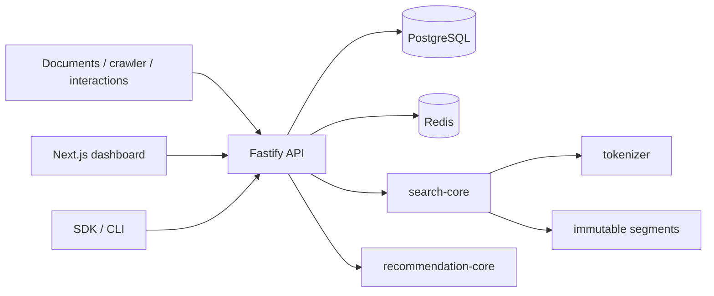
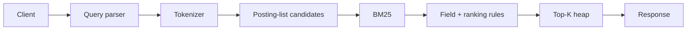

# Seekr

**A self-hosted search and recommendation engine implemented from first principles in TypeScript.**

Seekr exists for developers who want to understand, run, and control their retrieval stack. It is not a wrapper around Elasticsearch, OpenSearch, Algolia, Meilisearch, Typesense, Solr, Pinecone, Weaviate, an embedding API, or any hosted search service. Its tokenizer, inverted index, posting lists, TF-IDF, BM25, top-K heap, Trie, edit distance, phrases, segments, and recommendation algorithms live in this repository.

> Seekr is pre-1.0 and designed for a single active search/index writer. Read the [scaling boundaries](docs/deployment.md#honest-scaling-boundaries) before production use.

## Key features

- Unicode-aware shared tokenizer with offsets, stop words, stemming hooks, and n-grams
- arbitrary searchable fields, per-field postings and lengths, BM25/TF-IDF, field weights, custom ranking rules, and explain mode
- filters, facets, sortable metadata, quoted phrases, proximity boost, safe highlighting, typo tolerance, spell correction, and synonyms
- Trie autocomplete plus history-aware query suggestions
- immutable segments, tombstones, compaction, checksummed snapshots, Redis response caching, jobs, and PostgreSQL source documents
- content-based, item-item, user-user, popularity, recency, and normalized hybrid recommendations
- respectful crawler with robots policy, allowlists, rate limits, retries, size/type limits, DNS/private-network SSRF controls, extraction, and deduplication
- Fastify REST API, scoped API keys, analytics, Prometheus metrics, Next.js dashboard, TypeScript SDK, CLI, and Docker Compose

## Architecture





The framework-neutral packages remain inspectable: [algorithm architecture](docs/architecture.md) explains the data structures, equations, examples, and complexity.

## Quick start

Requirements: Node.js 24+, pnpm 11+, and Docker Compose.

```bash
cp .env.example .env
pnpm install
pnpm dev:services
pnpm db:migrate
pnpm dev
```

PowerShell: `Copy-Item .env.example .env`. The dashboard is at `http://localhost:3000`; the API is at `http://localhost:4000`. Or start the whole stack:

```bash
docker compose up --build
```

For a new project, call `POST /v1/projects`, create an index schema, then create the first project API key. The raw key is returned once. Store it securely.

## REST API example

```bash
curl -X POST http://localhost:4000/v1/indexes/$INDEX_ID/search \
  -H "Authorization: Bearer $SEEKR_API_KEY" \
  -H "Content-Type: application/json" \
  -d '{"query":"\"machine learning\" systems","limit":10,"typoTolerance":true,"highlight":true}'
```

## SDK example

```ts
import { SeekrClient } from '@seekr/sdk';

const seekr = new SeekrClient({
  baseUrl: 'http://localhost:4000',
  apiKey: process.env.SEEKR_API_KEY,
});

const result = await seekr.indexes.search(indexId, {
  query: 'machine learning',
  filters: [{ field: 'category', operator: 'equals', value: 'education' }],
  facets: ['category'],
  highlight: true,
});
```

See the polished [documentation-search example](examples/docs-search) and [SDK/CLI guide](docs/sdk-cli.md).

## Search and recommendation capabilities

Search candidates come from posting-list unions/intersections, never a scan of unrelated documents. BM25 is the default, TF-IDF remains selectable, and a bounded heap selects `offset + limit` results. Exact terms outrank fuzzy/synonym expansions. Phrase matching uses stored same-field positions. Facets count the filtered candidate set.

Recommendations derive sparse TF-IDF content vectors and weighted interaction vectors, compare them with cosine similarity, normalize component scores, and combine content, collaborative, popularity, and recency signals. Cold users fall back to meaningful available signals rather than fabricated results.

## Benchmarking and relevance

```bash
pnpm benchmark
pnpm loadtest
```

Benchmarks report real measurements for the current machine and write ignored JSON artifacts; this README intentionally contains no fabricated numbers. Relevance helpers compute Precision@K, Recall@K, MRR, DCG, and NDCG. See [performance and evaluation](docs/performance.md).

## Project structure

```text
apps/             api · crawler · web
packages/         tokenizer · search-core · recommendation-core · sdk · cli · shared · config
infrastructure/   Docker image and ordered PostgreSQL migrations
examples/         public-API integration examples
docs/             user, algorithm, deployment, backup, and operations guides
```

## Commands

| Command             | Purpose                          |
| ------------------- | -------------------------------- |
| `pnpm dev`          | run applications in watch mode   |
| `pnpm build`        | production-build every workspace |
| `pnpm test`         | deterministic Vitest suite       |
| `pnpm typecheck`    | strict TypeScript checks         |
| `pnpm lint`         | ESLint checks                    |
| `pnpm format:check` | Prettier verification            |
| `pnpm benchmark`    | search-core performance suite    |
| `pnpm loadtest`     | live API workload generator      |

## Documentation and community

Start at the [documentation index](docs/README.md). Contributions are welcome; read [CONTRIBUTING.md](CONTRIBUTING.md), the [Code of Conduct](CODE_OF_CONDUCT.md), and [security policy](SECURITY.md).

## Roadmap

Next priorities are connecting immutable segments/snapshots to the complete API lifecycle, a dedicated background worker process, crash-safe online migration orchestration, richer language analysis, and—only after correctness and operational work—multi-node sharding and replication.

## License

[MIT](LICENSE)
