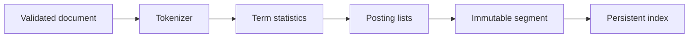
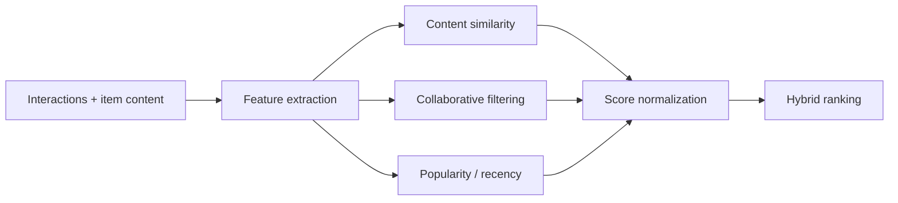

# Architecture and algorithms

Seekr is a strict TypeScript monorepo. Next.js, Fastify, and crawler processes live under `apps`; framework-neutral algorithms live under `packages`. PostgreSQL is durable product state, Redis is a disposable cache, and immutable filesystem segments provide search-index persistence. Core code never calls a hosted search, vector, embedding, or recommendation API.






## Tokenizer

The shared pipeline performs Unicode normalization, lowercase conversion, punctuation-to-space handling, whitespace normalization, splitting, empty removal, configurable stop-word removal, optional stemming, and optional n-grams as independent stages. Detailed tokens retain position and original UTF-16 start/end offsets. If input has `n` code units, ordinary processing is `O(n)` time and `O(n)` output space. N-grams add `O(t × (maxN-minN))` terms for `t` tokens.

## Inverted index and posting lists

The dictionary maps a normalized term to document maps and then field postings. A posting stores document ID, field, term frequency, positions, and offsets. Reverse document-to-term sets make update/delete touch only the old document's terms rather than scan the dictionary. Indexing is `O(T)` expected time for `T` tokens (Map operations amortized); deletion is `O(U + P)` for that document's unique terms/postings; exact term lookup is `O(1)` expected plus `O(df)` to return its postings. Document/field lengths, totals, DF, vocabulary length buckets, Trie membership, and exact metadata indexes update transactionally with postings.

## TF-IDF and BM25

TF-IDF uses term frequency and smoothed inverse document frequency. Its intuition is that repeated terms matter while terms present in most documents discriminate less. Seekr also exposes the textbook `log(N/df)` calculation for explanation.

BM25 is the default:

```text
IDF(t) = log(1 + (N - df(t) + 0.5) / (df(t) + 0.5))
score(D,Q) = Σ IDF(t) × tf(t,D)(k1+1)
              / (tf(t,D) + k1(1-b+b|D|/avgdl))
```

Defaults are `k1=1.2`, `b=0.75`. `k1` controls term-frequency saturation and `b` controls length normalization. Seekr scores per field using that field's length/average and weight, which is more meaningful than multiplying a final mixed score. Query-time work visits unioned posting lists, not unrelated documents.

## Top-K retrieval

A generic binary min-heap retains only `offset + limit` best candidates. Push/pop are `O(log k)`, peek is `O(1)`, and memory is `O(k)`. Candidate selection is approximately `O(n log k)` versus `O(n log n)` for a full sort; the retained page is finally sorted for deterministic descending output.

## Trie and fuzzy matching

Trie insert, contains, and prefix descent are `O(L)` for term length `L`; suggestions traverse only the prefix subtree and are ordered by document frequency. Vocabulary refcounts remove terms only when their final posting disappears.

Levenshtein distance uses two dynamic-programming rows: `O(mn)` time and `O(min(m,n))` memory. Fuzzy generation first consults vocabulary length buckets (and configurable prefix constraints), then calculates distance only for plausible lengths. This avoids a full dictionary scan for most queries. Exact matches outrank fuzzy terms through distance penalties.

## Phrase and proximity search

Quoted phrases intersect document and field postings, then align sorted position lists at offsets `p, p+1, ...`. Original text is never rescanned, and terms in different fields cannot form a phrase. Normal multi-term queries may receive a bounded proximity boost based on minimum same-field position gaps; BM25 remains primary.

## Immutable segments

New documents accumulate in memory and flush into an immutable segment containing serialized documents, dictionary/postings-derived search state, and statistics. A manifest orders active segments and tombstones hide deleted or superseded documents. Search loads segments, excludes tombstoned/older versions, and merges candidates. Compaction rewrites live documents into a new segment, atomically swaps the manifest, then removes obsolete files. Immutability makes readers lock-light, makes partial flushes avoid corrupting existing data, and permits incremental indexing. Current cross-segment ranking rebuilds a merged in-memory view for global statistics; it is intentionally understandable rather than a distributed shard protocol.

## Recommendations

Content features are normalized sparse TF-IDF vectors; cosine similarity is their dot product after normalization. Collaborative item/user vectors reuse weighted interactions and cosine similarity. Hybrid ranking normalizes available content, collaborative, popularity, and recency scores before a weighted sum, preventing components with different raw ranges from dominating accidentally. See [Recommendations](recommendations.md).

## Dependency direction and boundaries

Applications may import packages; algorithm packages never import applications. `search-core` depends only on the tokenizer, recommendation-core owns its algorithms, and shared contains transport-safe schemas. Storage interfaces keep the in-memory engine independent of PostgreSQL and filesystem adapters. The current live API index is single-process and reconstructed from PostgreSQL documents on restart; segment/snapshot APIs are implemented in search-core but full API lifecycle adoption is remaining technical debt.
